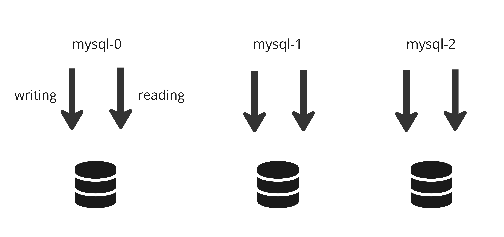

# Kubernetes: StatefulSet vs Deployment

## Stateless vs Stateful Applikationen

Um die Differenz zwischen StatefulSets und Deployment zu verstehen, müssen wir zuerst zwischen den beiden Fachbegriffen **Stateless** und **Stateful** unterscheiden:

### <u>Stateless</u>
Stateless Applikationen speichern keine vergangene Daten sowie Zustände. Somit sind Stateless Applikationen unabhängig von früheren Daten. Jeder Request der an die Applikation gemacht wird ist komplett neu.

<u>**Beispiele**</u>

<ul>
<li>Apache Webserver</li>
<li>Nginx Webserver</li>
</ul>

### <u>Stateful</u>
Die Daten werden in Stateful Applikationen dauerhaft gespeichert. Die Applikation erstellt Aufzeichnungen und prüft diese. Der Nachteil hierbei ist jedoch dass die Skalierung deutlich schwieriger ist als bei einer Stateless Applikation. Stateful Applikation sind somit abhängig von der letzten akuellsten Status der Datei.

<u>**Beispiele**</u>

<ul>
<li>Datenbanken (MySQL, MongoDB etc.)</li>
<li>CMS (WordPress, Drupal etc.)</li>
</ul>

**Stateless: Keine dauerhaften Daten, einfach zu skalieren.**
 
**Stateful: Dauerhafte Daten, komplexer zu skalieren.**

 

Aufgrund der Differenz zwischen Stateful und Stateless Applikationen werden diese verschieden deployed (eingesetzt):

## Deployment
Für Stateless Applikationen wird Deployment verwendet. Dieser wird verwendet, um den Zustand einer Anwendung zu verwalten und sicherzustellen, dass eine bestimmte Anzahl an Pod-Replikas immer ausgeführt wird.

Hier eine kurze Auflistung der Hauptmerkmale von Deployment:

**Verwaltung der Replikas**

Ein Deployment sorgt dafür, dass immer eine definierte Zahl an Replikas läuft. Falls ein Pod ausfällt, erstellt das Deployment automatisch einen neuen, um den gewünschten Zustand aufrechtzuerhalten.

**Selbstheilung**

Pods die fehlerhaft sind oder nicht mehr laufen werden automatisch ersetzt oder neugestartet.

**Rolling Updates**

Mit Rolling Updates kann Deployment reibungslose Updates durchführen ohne Ausfallzeiten. Hier werden die Pods nach und nach aktualisiert damit die Anwendungen während des Updates verfügbar bleiben.

**Rollbacks**

Falls ein Update fehlschlägt oder Probleme bereitet, kann mit sogenannten Rollbacks auf eine frühere Version zurückgesetzt werden um eine stabilen Zustand zu erreichen.

**Skalierung**

Mit Deployments kann man einfach die Anzahl der Pods skalieren (hinzufügen oder entfernen) um den Anforderungen gerecht zu werden.

 

**Wir fassen zusammen für Deployment:**

<ul>
<li>Die Replikate sind identisch und untereinander auswechselbar</li>
<li>Deployment balanciert die Ladung unter den Replikas um ein stabilen Zustand zu gewährleisten.</li>
<li>Die Funktion Rolling Updates und Rollbacks ermöglicht Ausfallzeiten sowie allfällige Updateschwierigkeiten zu vermeiden.</li>
</ul>

## StatefulSet
Für Stateful Applikationen wird StatefulSets verwendet. Im Gegensatz zu Deployment ist das Kopieren der Applikation schwieriger. Ausserdem benötigen diese mehr Voraussetzungen, welche stateless Applikationen nicht benötigen. 

Hier eine kurze Auflistung der Hauptmerkmale von StatefulSet:

**Geordnete, vorhersehbare Poderstellung/Löschung**

Pods werden in einer bestimmten Reihenfolge erstellt und gelöscht, was wichtig ist für Anwendungen, die eine geordnete Initialisierung oder einen geordneten Shutdown erfordern.

**Stabile, persistente Speicher**

StatefulSets verwenden Persistent Volume Claims (PVCs), um sicherzustellen, dass jeder Pod seinen eigenen persistenten Speicher hat. Diese Speicher bleiben auch dann bestehen, wenn der Pod neu gestartet oder verschoben wird.

**Eindeutige Netzwerk-ID**

Jeder Pod in einem StatefulSet besitzt einen eindeutigen Namen. Dadurch sind die Replika Pods untereinander nicht identisch. Jeder von den Pods hat seinen eigene "Pod Identity".

 

Weshalb benötigt es solche "Pod Identities"?

**Skalierbare Datenbankapplikation!**

Stell dir vor du hast 3 MySQL Replikas erstellt und alle können jeweils die Grundrechte "writing" und "reading" nutzen. Dadurch dass jede Datenbank etwas ändern kann, kanne s zu **Daten Inconsistency** führen. Es kann nicht mehr sichergestellt werden, dass die Daten in den Datenbanken gleich sind.

Die Lösung ist wie folgt:

Die erste Applikation ist der Master und kann als einziges Änderungen durchführen und die Replikas werden als Slave bezeichnet und haben nur Leserechte.

Falls Master seine Datenbank anpasst, müssen die Slave Replikas ebenfalls Ihre Datenbank aktualisieren, um synchron zu bleiben mit dem Master.

Was passiert wenn ein neuer Slave Pod hinzugefügt wird?

Der neu erstellte Pod nimmt alle aktuellsten Daten vom vorherigen Slave und synchronisiert sich danach wie die anderen Slave Pods ebenfalls.

## StatefulSet vs Deployment

| Merkmale                  | Deployment                           | StatefulSet                                             |
|---------------------------|--------------------------------------|---------------------------------------------------------|
| Nutzen                    | Verwaltung von stateless Anwendungen | Verwaltung von stateful Anwendungen                     |
| Pod-Identity              | Pods sind identisch und austauschbar | Jeder Pod hat eine eindeutige Identity                  |
| Pod-Name                  | Zufällige Hash Namen                 | Fixe geordnete Namen (my-app-0, my-app-1)               |
| Skalierung                | einfach und schnell                  | Komplex, da Reihenfolge und Identity wichtig sind       |
| Erstellung und Beendigung | Keine bestimmte Reihenfolge          | Geordnete Reihenfolge für Erst. und Beendigung          |
| Rolling Updates           | Unterstützt                          | Unterstützt, aber Pods werden nacheinander aktualisiert |
| Anwendungsfälle           | Web-Server, APIs, stateless Microservices                 | Datenbanken, verteilte Dateisysteme, stateful Microservices |
